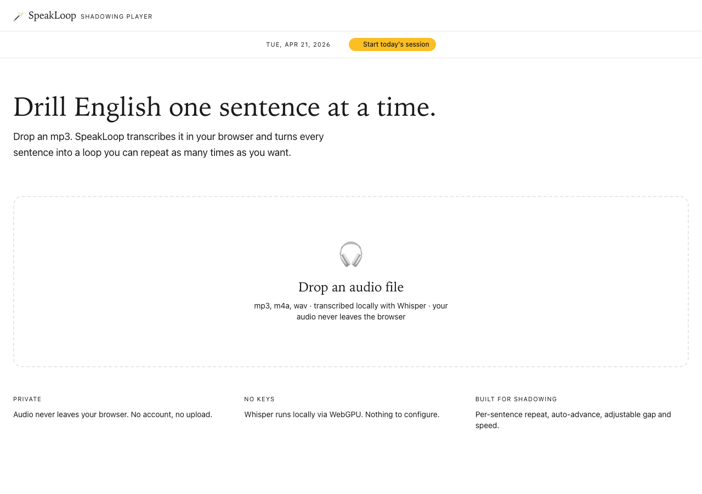

# SpeakLoop 🪄

> mp3 하나 던지면 자동으로 문장별로 쪼개고, 원하는 횟수만큼 반복해주는 브라우저 영어 스피킹 연습기. API 키도, 계정도, 서버도 필요 없음.



브라우저에서 돌아가는 mp3 섀도잉 플레이어. Natural Reader랑 Speechify 느낌인데 저 둘에 없는 기능이 하나 있습니다: **문장별 반복 횟수 지정 + 자동 넘어가기** — 한 문장 5번 돌리고 마우스 안 건드려도 다음 문장으로 넘어갑니다.

[English version](./README.md)

## 이런 용도에 좋아요

mp3로 들고 올 수 있는 건 전부 섀도잉 드릴로 바뀝니다:

- **오픽 / 토플 스피킹 연습** — 답변을 녹음하거나 TTS로 뽑아서, 문장별로 입에 붙을 때까지 반복
- **면접 답변** — 외워둔 답변을 한 문장씩 드릴
- **교재 / 팟캐스트 발췌** — 짧은 구간을 올려서 문장 단위로 섀도잉
- **TTS 결과물** (ElevenLabs, OpenAI TTS, Edge TTS 등) — 쓴 스크립트를 반복 재생 가능한 연습 트랙으로

전사는 브라우저 안에서 [Whisper](https://openai.com/research/whisper)가 [🤗 Transformers.js](https://github.com/huggingface/transformers.js) 위에서 돌아요 — 오디오가 탭 밖으로 나가지 않습니다.

## 기능

- **자동 문장 분할** — Whisper가 정확한 타임코드로 전사 + 문장 단위로 쪼갬
- **문장별 반복 횟수** — 1× / 2× / 3× / 5× / 10× / ∞ 원클릭
- **자동 넘어가기** — N번 반복 후 다음 문장으로 자동 이동
- **Now Reading 패널** — 현재 문장을 큰 글씨로 보여주고, 진행률 바 + 단어 하이라이트
- **녹음 & A/B 비교** — 문장별로 내 발음을 녹음하고, 원본과 연속 재생해서 귀로 비교. IndexedDB에 저장되어 새로고침해도 유지
- **하루 한 번 타이머** — 헤더 아래 얇은 바에 오늘 날짜 + Start 버튼. 시작하면 HH:MM으로 실시간 카운트, End 누르면 오늘은 잠금 → 자정 넘으면 다음 날로 리셋되어 매일 한 번의 의식처럼 쓰기
- **속도 & 간격 조절** — 0.5×–2× 속도, 0~2초 반복 사이 공백(섀도잉용)
- **100% 로컬** — 오디오가 브라우저 밖으로 나가지 않음. 서버 없음, API 키 없음
- **WebGPU 가속** — Apple Silicon / 최신 GPU에서 CPU 대비 5~10배 빠름

## 로컬에서 실행

Node 18 이상 필요.

```bash
git clone https://github.com/JinJuLee/englishspeak.git
cd englishspeak/web
npm install
npm run dev
```

**Chrome 또는 Edge**에서 http://localhost:5173/ 열기. (Safari는 Whisper가 필요로 하는 교차 출처 격리 모드를 지원하지 않아요.)

첫 mp3 업로드 시 Whisper base 모델(약 150MB)을 다운로드합니다. Chrome이 IndexedDB에 캐싱해서 두 번째부터는 즉시 로드됩니다.

## 사용법

1. 상단 바의 **Start today's session** 클릭 → 오늘의 타이머 시작. 자정까지 다시 시작 불가
2. mp3를 페이지에 드래그 앤 드롭 (또는 클릭해서 선택)
3. 전사 대기 (음원 길이에 따라 수 초~수 십 초)
4. 원하는 문장 탭하면 그 문장부터 반복 시작. 마이크 버튼으로 내 발음 녹음 후 A/B로 원본과 비교 가능
5. 하단 컨트롤 바에서 반복 횟수, 속도, 간격 조절
6. 끝나면 상단 **End** 버튼 → 오늘 세션 잠금

**추천 섀도잉 루틴:** 반복 3×, 속도 0.75×, Auto-next 켜기 → 핸즈프리로 스크립트 전체를 한 번에 연습

## 배포하기

순수 정적 사이트지만 ONNX Runtime이 요구하는 SharedArrayBuffer 때문에 두 개의 HTTP 응답 헤더가 필요해요:

```
Cross-Origin-Opener-Policy: same-origin
Cross-Origin-Embedder-Policy: credentialless
```

### Cloudflare Pages (추천 — 무료, 무제한)

1. 이 레포를 GitHub에 푸시 (이미 완료됨)
2. Cloudflare Pages에서 레포 연결
3. 빌드 명령: `npm run build` · 출력 디렉토리: `dist` · 루트 디렉토리: `web`
4. `web/public/_headers` 파일 추가:

   ```
   /*
     Cross-Origin-Opener-Policy: same-origin
     Cross-Origin-Embedder-Policy: credentialless
   ```

### Vercel

1. 레포 import
2. 프레임워크 프리셋: Vite · 루트 디렉토리: `web`
3. `web/vercel.json` 추가:

   ```json
   {
     "headers": [
       {
         "source": "/(.*)",
         "headers": [
           { "key": "Cross-Origin-Opener-Policy", "value": "same-origin" },
           { "key": "Cross-Origin-Embedder-Policy", "value": "credentialless" }
         ]
       }
     ]
   }
   ```

### GitHub Pages

**지원 안 됨** — 커스텀 응답 헤더 설정을 할 수 없어서 SharedArrayBuffer가 켜지지 않아 Whisper가 초기화에 실패합니다.

## 기술 스택

- Vite + React 19 + TypeScript
- Tailwind CSS v3
- [@huggingface/transformers](https://github.com/huggingface/transformers.js) v3 (Whisper base, WebGPU)
- HTML5 Audio + 커스텀 문장별 루프 엔진

## 구조

```
web/
├── public/                         # 정적 파일
├── src/
│   ├── App.tsx
│   ├── components/
│   │   ├── FileDrop.tsx            # 드래그 앤 드롭 업로드
│   │   ├── ProgressCard.tsx        # 디코드 + 모델 다운로드 상태
│   │   ├── NowReading.tsx          # 현재 문장 크게 표시
│   │   ├── SentenceList.tsx        # 문장 클릭 점프
│   │   └── ControlBar.tsx          # 재생 / 속도 / 반복 / 간격
│   └── lib/
│       ├── transcribe.ts           # 메인 스레드 API
│       ├── transcribe.worker.ts    # Whisper 워커
│       └── useAudioLooper.ts       # 문장별 루프 엔진
└── vite.config.ts
```

## 알려진 제약

- **Safari 미지원.** WebKit이 `Cross-Origin-Embedder-Policy: credentialless`를 지원 안 해서 외부 출처 모델 파일에 SharedArrayBuffer를 못 씀. Chrome/Edge 써주세요.
- **iOS Safari도 같은 이유로 제약.** 공개 HTTPS URL로 배포하면 iOS 18.2+에서 돌긴 하는데 WebGPU가 플래그 뒤에 있어서 느려요.
- **영어 기본.** 모델은 99개 언어 지원 — `src/App.tsx`의 `language: "en"`을 바꾸거나 언어 선택 UI를 추가하면 됨.
- **Whisper base** 가 정확도/크기 스위트스팟. 더 정확한 걸 원하면 `src/lib/transcribe.ts`에서 `onnx-community/whisper-small` (약 250MB)로 교체.

## 관련 문서

- [`english_practice_workflow.md`](./english_practice_workflow.md) — 이 앱이 웹 케이스에서 대체하는 Aiko + AudioLingo + ElevenLabs 원래 워크플로우

## 라이선스

MIT

---

_Made with 🪄 by **PearlLeeStudio**_
